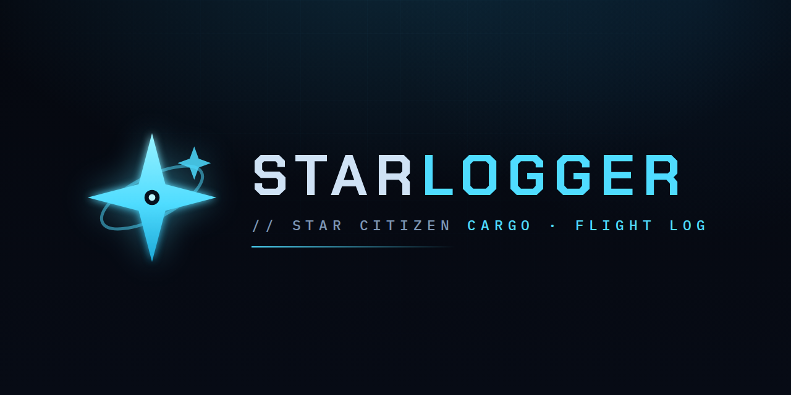

<p align="center">
  
</p>

# Starlogger

**Starlogger** tails Star Citizen's `Game.log` and serves a web dashboard at
**http://127.0.0.1:8765** that models your accepted cargo missions and **groups
the work by route** — what to load at each origin, what to drop at each
destination — plus a 3-D **cargo-grid loader**, a per-session **archive**, and
**session replay** that scrubs the whole dashboard through any past session.

Runs on **Linux (Wine/Proton)** and **native Windows** — the same codebase
auto-detects the install for each.

## Setup

**Linux:**
```bash
python3 -m venv .venv
.venv/bin/pip install -r requirements.txt
```

**Windows (PowerShell or cmd):**
```bat
py -m venv .venv
.venv\Scripts\pip install -r requirements.txt
```

The only runtime dependency is Flask. The ship cargo-grid database
(`ships_cargo.json`) ships with the repo, so it works out of the box; see
[Ship cargo data](#ship-cargo-data) for how it's kept current.

## Run

```bash
.venv/bin/python tracker.py            # Linux: auto-detect Game.log, serve :8765
.venv\Scripts\python tracker.py        # Windows: same (or double-click run-tracker.bat)
.venv/bin/python tracker.py --port 9000
.venv/bin/python tracker.py --once     # parse once, print JSON, exit
.venv/bin/python tracker.py --rebuild  # backfill the archive from logbackups/
```

Leave it running while you play; the dashboard polls every few seconds and resets
itself when you relaunch the game. It auto-detects the LIVE `Game.log` (on Windows,
`%ProgramFiles%\Roberts Space Industries\StarCitizen\LIVE\Game.log`). Point it at a
specific log with `--log PATH` or the `GAME_LOG` env var (the escape hatch for a
non-default install drive/folder). `SCMT_DATA_DIR` sets where the generated `*.json`
data (and the downloaded extractor binary) are stored — defaults to the repo root.

## Run it with the game

**Windows:** run `run-tracker.bat` in a terminal (or make a desktop shortcut to it);
Ctrl-C stops it. `SCMT_DATA_DIR` defaults to `%LOCALAPPDATA%\starlogger`.

**Linux (LUG `sc-launch.sh`):** to start the tracker with the game and stop it when
you quit, add one line just before the launcher line in the
[LUG Helper](https://github.com/starcitizen-lug/lug-helper)'s `sc-launch.sh`:

```bash
GAME_LOG="$user_cfg_dir/Game.log" "$HOME/Code/starlogger/run-tracker.sh" &
```

`run-tracker.sh` backgrounds the dashboard and uses `setpriv --pdeathsig` so the
kernel stops it whenever `sc-launch.sh` exits — even on SIGKILL — with no `kill`
line to get wrong. It skips if `:8765` is already serving. (LUG Helper may
overwrite `sc-launch.sh` on update; keep a copy.)

## Dashboard

Six tabs (deep-linked via the URL hash):

- **Loading** — per pickup station: total SCU and the cargo to load, with each
  parcel's destination. Legs grey out once picked up.
- **Manifest** — the **cargo-grid loader**: an isometric 3-D view of your ship's
  hold packed in delivery order (first-out on top), with a **load sequence** of
  elevators to bring up. Each bay is labelled (Rear, Mid, Nose, Module 1…) and a
  **▲ FWD** marker shows the bow.
- **Unloading** — per destination: total SCU and cargo to drop, with its origin.
- **Routes** — origin → destination pairs aggregated into an ordered trip.
- **Contracts** — full mission table with per-row **Edit** / **Delete**.
- **Archive** — pooled, cross-session logs: a **Contract Log** (with a high-level
  type filter), **Trade Loads** (manual buy/sell P&L plus your best trade routes),
  a **Travel Log** of quantum jumps, and a **Sessions** list with **replay** —
  pick a session and scrub the entire dashboard through its past states.

The live tabs are always cargo-only; non-trade missions (couriers, combat) appear
only in the Archive. The capacity gauge and grid follow the game-detected ship, or
a ship you pick in the **SHIP** box at the top. The all-ships grid reference is at
**/grids.html**.

## Ship cargo data

`ships_cargo.json` (per-ship SCU, deck-accurate grid geometry, names, manufacturer,
role) is read **straight from the game's own `Data.p4k`** — no third-party site.
The tracker drives [StarBreaker](https://github.com/diogotr7/StarBreaker), a Rust
extractor it downloads once (SHA-256-pinned, the right Linux or Windows build for
your OS) into `SCMT_DATA_DIR/bin`, and rebuilds the database only when the game's
**major version changes**, at background priority so it never disturbs the game.
This needs the game installed with `Data.p4k` next to `Game.log`; if it isn't found
the tracker just keeps using the committed `ships_cargo.json` (so most users never
run the extractor).

## Fixing recovered data

The log isn't always complete, so any mission is editable from the **Contracts**
tab: **Edit** (title, origin, reward, and per-leg cargo/qty/destination — with
autocomplete and `12k`/`1.5m` reward shorthand), **Delete** (hide; restorable),
and **Reset to log**. Edits persist in `overrides.json`, keyed by mission id.

Two common gaps:

- **Missing pickup names** — the log rarely prints origin station names, so the
  tracker learns a `zoneHostId → name` map (persisted in `station_names.json`).
  Rename any station from its Loading/Unloading card, or run `--recover-stations`
  to backfill the map from your `logbackups/`.
- **Missing quantities** — accepting missions in a burst can drop their quantity
  lines; those show as `?` and are flagged partial. Fill them in via **Edit**.

## Project layout

```
tracker.py        CLI entry point
run-tracker.sh    Linux: start the tracker for a play session (sc-launch hook)
run-tracker.bat   Windows: start the tracker for a play session
scmt/             package:
                    config · patterns · model · state (log parser) · snapshot ·
                    planner · overrides · stations · shipcargo · scdata
                    (Data.p4k extraction) · archive · replay (session replay) ·
                    maintenance · tailer · settings · server (Flask)
web/              dashboard front-end:
                    index.html · styles.css · app.js · cargogrid.js (3-D grid
                    renderer) · grids.html (all-ships reference) ·
                    logo.svg / icon.svg (brand)
assets/           social-preview.png · icon.png (repo/brand images)
```

Generated data lives in `SCMT_DATA_DIR` (repo root by default): `overrides.json`,
`sessions.json`, `settings.json`, `station_names.json`, `ships_cargo.json`, and the
extractor in `bin/`.
